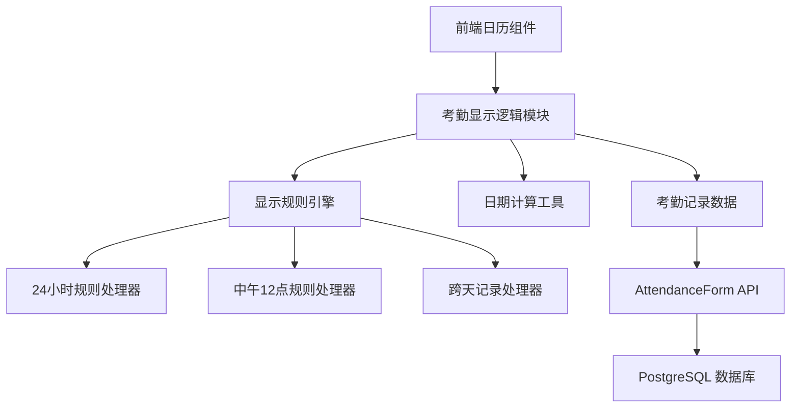

# 考勤日历显示逻辑设计文档

## 概述

本设计文档定义了考勤管理系统中日历显示逻辑的技术实现方案。系统需要根据考勤记录的时间范围、持续时长以及特定的业务规则来决定在日历上每一天显示的考勤类型。

核心挑战在于处理跨天考勤记录的显示逻辑，特别是需要实现：
1. 24小时规则：只有当天考勤时长达到24小时才显示对应考勤类型
2. 中午12点规则：以中午12点为界限判断首日显示逻辑
3. 短期考勤处理：不满24小时的跨天考勤的特殊处理

## 架构

### 系统架构图



### 技术栈

- **前端**: React 18.2.0, date-fns 库用于日期处理
- **后端**: Flask 3.0.0, SQLAlchemy 2.0.40
- **数据库**: PostgreSQL with JSONB 支持
- **日期处理**: date-fns (前端), Python datetime (后端)

## 组件和接口

### 前端组件

#### AttendanceDisplayLogic 模块

```javascript
// 核心显示逻辑模块
class AttendanceDisplayLogic {
  // 计算每日显示状态
  calculateDailyDisplay(attendanceRecords, targetDate)
  
  // 应用24小时规则
  apply24HourRule(record, targetDate)
  
  // 应用中午12点规则
  applyNoonRule(record, targetDate)
  
  // 处理跨天记录
  processMultiDayRecord(record, targetDate)
}
```

#### 日历组件接口

```javascript
// 日历组件接口
interface CalendarDay {
  date: Date;
  displayType: AttendanceType;
  displayLabel: string;
  duration?: string;
  isDisabled: boolean;
}

interface AttendanceRecord {
  date: string;
  type: AttendanceType;
  startTime: string;
  endTime: string;
  daysOffset: number;
  hours: number;
  minutes: number;
}
```

### 后端接口

#### AttendanceForm API

现有的 `/api/attendance-forms` 端点将继续使用，数据结构保持不变：

```python
# 考勤记录数据结构
{
  "rest_records": [...],
  "leave_records": [...],
  "overtime_records": [...],
  # ... 其他考勤类型
}
```

## 数据模型

### 考勤记录模型

```javascript
// 单条考勤记录
{
  date: "2024-12-03",           // 开始日期
  type: "leave",                // 考勤类型
  startTime: "09:00",           // 开始时间
  endTime: "18:00",             // 结束时间
  daysOffset: 2,                // 跨天偏移量
  hours: 72,                    // 总小时数
  minutes: 0                    // 总分钟数
}
```

### 日历显示状态

```javascript
// 每日显示状态
{
  date: "2024-12-03",
  effectiveType: "leave",       // 实际显示的考勤类型
  displayLabel: "请假",         // 显示标签
  duration: "24h",              // 显示时长
  isFirstDay: true,             // 是否为记录首日
  isLastDay: false,             // 是否为记录末日
  appliedRule: "noon_rule"      // 应用的规则类型
}
```

## 错误处理

### 数据验证

1. **时间范围验证**
   - 开始时间不能晚于结束时间
   - 跨天记录的 daysOffset 必须为非负整数
   - 时间格式必须为 HH:MM

2. **业务规则验证**
   - 考勤记录不能超出合同有效期
   - 同一天不能有冲突的考勤记录

### 错误恢复策略

1. **数据不一致处理**
   - 当计算出的显示状态与预期不符时，记录警告日志
   - 提供降级显示方案（显示为"出勤"）

2. **性能优化**
   - 缓存计算结果，避免重复计算
   - 使用 useMemo 优化 React 组件性能

## 测试策略

### 单元测试

**测试覆盖范围**：
- 日期计算函数
- 显示规则处理器
- 跨天记录处理逻辑
- 边界条件处理

**测试工具**：
- Jest (JavaScript 单元测试)
- React Testing Library (组件测试)
- pytest (Python 后端测试)

### 属性测试

使用 fast-check 库进行属性测试，验证显示逻辑的正确性：

**测试库选择**: fast-check 4.0+ (JavaScript 属性测试库)

**配置要求**: 每个属性测试运行最少 100 次迭代

**属性测试标记格式**: `**Feature: attendance-display-logic, Property {number}: {property_text}**`

## 正确性属性

*A property is a characteristic or behavior that should hold true across all valid executions of a system-essentially, a formal statement about what the system should do. Properties serve as the bridge between human-readable specifications and machine-verifiable correctness guarantees.*

基于需求分析，以下是考勤显示逻辑系统必须满足的正确性属性：

### 属性 1: 跨天记录显示一致性
*For any* 跨天考勤记录和目标日期，当天显示的考勤类型应该基于当天实际工作时长：满24小时显示对应考勤类型，不满24小时显示"出勤"
**Validates: Requirements 1.1, 1.2**

### 属性 2: 中午12点规则优先性
*For any* 考勤记录，首日显示状态应该由开始时间决定：中午12点前开始显示考勤类型，中午12点后开始首日显示"出勤"且第二天显示考勤类型
**Validates: Requirements 1.3, 1.4, 1.7**

### 属性 3: 短期考勤特殊处理
*For any* 总时长不满24小时的考勤记录，显示逻辑应该优先遵循中午12点规则而非24小时规则
**Validates: Requirements 1.5, 1.6**

### 属性 4: 考勤记录去重一致性
*For any* 包含同一客户同一员工多条记录的考勤列表，系统应该合并显示或只显示最新记录，确保每个员工每天只有一个显示状态
**Validates: Requirements 2.1**

### 属性 5: 每日时长计算准确性
*For any* 跨天考勤记录和目标日期，计算的当天工作时长应该准确反映该日期0点到24点之间的实际考勤时间
**Validates: Requirements 3.1**

### 属性 6: 输入验证完整性
*For any* 包含无效时间范围的考勤记录（如开始时间晚于结束时间），系统应该拒绝处理并返回明确的错误信息
**Validates: Requirements 3.3, 3.4**

### 属性 7: 考勤类型组合处理
*For any* 考勤类型组合的测试数据，系统应该为每种有效组合返回正确且一致的显示结果
**Validates: Requirements 4.4**

### 边界情况处理

以下边界情况需要特别关注，将通过专门的边界测试用例验证：

- **中午12点整点**：开始时间恰好为12:00的考勤记录
- **跨月跨年**：考勤记录跨越月份或年份边界
- **月末月初**：在月份边界的考勤记录处理
- **最小时长**：1分钟或更短的考勤记录
- **最大时长**：跨越多天的长期考勤记录

**Validates: Requirements 4.2**